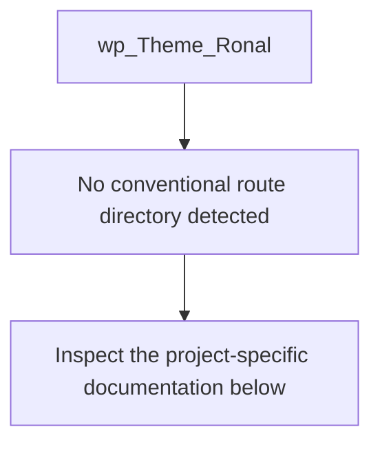
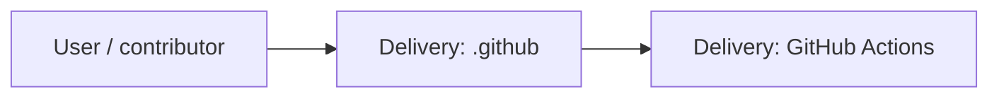
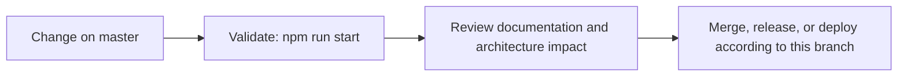

<div align="center">

# WordPress Theme — Ronal Chhetri Portfolio

<!-- interactive-readme-standard:start -->

> [!NOTE]
> **Branch-specific documentation:** this section is maintained for [`master`](https://github.com/Nischhalsubba/wp_Theme_Ronal/tree/master). It is generated from the files present on this branch and preserves the project-authored README below.

<details open>
<summary><strong>Interactive repository guide</strong></summary>

## Branch overview

| Item | Value |
|---|---|
| Repository | [`Nischhalsubba/wp_Theme_Ronal`](https://github.com/Nischhalsubba/wp_Theme_Ronal) |
| Branch | [`master`](https://github.com/Nischhalsubba/wp_Theme_Ronal/tree/master) |
| Detected stack | WordPress, Sass, PHP, JavaScript, CSS |
| Detected manifests | package.json |
| Documentation policy | Every maintained branch must explain purpose, setup, structure, architecture, flows, testing, delivery, security, and ownership. |

## Repository structure

```mermaid
flowchart TD
    ROOT["wp_Theme_Ronal / master"]
    ROOT --> P0[".github/"]
    ROOT --> P1["assets/"]
    ROOT --> P2["languages/"]
    ROOT --> P3[".editorconfig"]
    ROOT --> P4[".eslintignore"]
    ROOT --> P5[".eslintrc.js"]
    ROOT --> P6[".gitignore"]
    ROOT --> P7["footer.php"]
    ROOT --> P8["front-page.php"]
    ROOT --> P9["front-page1.php"]
    ROOT --> P10["functions.php"]
    ROOT --> P11["gulpfile.babel.js"]
    ROOT --> P12["header.php"]
    ROOT --> P13["home.php"]
    ROOT --> P14["index.php"]
    ROOT --> P15["package-lock.json"]
    ROOT --> P16["package.json"]
    ROOT --> P17["page-contact-us.php"]
    ROOT --> MORE["+ 10 more top-level entries"]
```



The diagram is generated from the branch's actual top-level files and directories. Use the branch link above for complete source navigation.

## Website or application structure



## Application and responsibility flow



## Change-to-delivery flow



## README requirements for this branch

- Explain what this branch contains and how it differs from the default branch.
- Keep installation, configuration, usage, testing, deployment, security, support, and license information accurate.
- Document repository, website or application, API, data, authentication, background-job, and deployment flows when they exist.
- Prefer Mermaid diagrams and expandable `<details>` sections for visual navigation.
- Link diagrams and modules to real source paths; never invent missing components.
- Preserve project-specific documentation and update diagrams whenever architecture or major paths change.
- Treat secrets, private infrastructure, customer data, and credentials as prohibited README content.

</details>

<!-- interactive-readme-standard:end -->

### Custom WordPress Portfolio Theme Workflow

**A WordPress portfolio theme developed with Sass, Gulp, JavaScript, BrowserSync, image optimization, RTL stylesheet generation, and translation-ready tooling.**


</div>

---

## ✨ Overview

This repository contains a custom WordPress theme workflow for a portfolio website created for **Ronal Chhetri**.

The theme is built with a frontend workflow that supports Sass compilation, JavaScript bundling, vendor scripts, image optimization, RTL stylesheet generation, translation file generation, and BrowserSync-based local development.

Original website context:

| Detail | Value |
|---|---|
| Project Type | WordPress Portfolio Theme |
| Client | Ronal Chhetri |
| Website | `www.ronalchhetri.com.np` |
| Core Workflow | Gulp + Sass + JavaScript |

---

## 🧭 Table of Contents

- [Project Purpose](#-project-purpose)
- [Designer’s Perspective](#-designers-perspective)
- [Tech Stack](#-tech-stack)
- [Theme Workflow](#-theme-workflow)
- [Available Scripts](#-available-scripts)
- [Local Development](#-local-development)
- [Suggested Theme Structure](#-suggested-theme-structure)
- [WordPress Setup Notes](#-wordpress-setup-notes)
- [Quality Checklist](#-quality-checklist)
- [Roadmap](#-roadmap)
- [License](#-license)

---

## 🎯 Project Purpose

The purpose of this repository is to provide a WordPress theme foundation for a personal portfolio website.

The theme workflow is designed to help with:

- writing modular Sass
- compiling production-ready CSS
- generating RTL stylesheets
- bundling vendor and custom JavaScript
- optimizing image assets
- generating translation `.pot` files
- maintaining a smoother WordPress development workflow

---

## 🎨 Designer’s Perspective

A portfolio theme needs to balance visual identity, content editing, performance, and maintainability.

From a designer-developer perspective, the theme should make it easy to maintain:

- strong visual hierarchy
- clean portfolio/project sections
- reusable layout patterns
- responsive typography
- fast-loading images
- smooth interactions
- accessible navigation
- translation-ready text

The Gulp workflow helps reduce manual tasks so the design can stay polished while the theme remains maintainable.

---

## 🛠 Tech Stack

| Layer | Technology | Purpose |
|---|---|---|
| CMS | WordPress | Theme runtime and content management |
| Styles | Sass | Modular source styling |
| Build Tool | Gulp | Task automation |
| JavaScript | Babel + Gulp tasks | Vendor/custom script processing |
| Local Dev | BrowserSync | Live reload development workflow |
| Images | gulp-imagemin | Image optimization |
| RTL | gulp-rtlcss | Right-to-left stylesheet generation |
| Translation | gulp-wp-pot | WordPress `.pot` file generation |
| Slider/Carousel | Glide.js | Frontend slider dependency |
| Linting | ESLint WordPress config | WordPress-oriented JS code quality |

---

## ⚙️ Theme Workflow

The package scripts reveal a WordPress-focused build workflow.

| Workflow | Description |
|---|---|
| Styles | Compile Sass into theme CSS |
| RTL Styles | Generate RTL CSS support |
| Vendor JS | Bundle/process third-party scripts |
| Custom JS | Bundle/process theme custom scripts |
| Images | Optimize image assets |
| Cache | Clear Gulp cache |
| Translate | Generate WordPress translation POT file |

---

## 📜 Available Scripts

| Command | Purpose |
|---|---|
| `npm start` | Runs the default Gulp workflow |
| `npm run styles` | Compiles theme styles |
| `npm run stylesRTL` | Generates RTL styles |
| `npm run vendorsJS` | Processes vendor JavaScript |
| `npm run customJS` | Processes custom JavaScript |
| `npm run images` | Optimizes images |
| `npm run clearCache` | Clears cached build assets |
| `npm run translate` | Generates WordPress translation file |

---

## 🚀 Local Development

### Prerequisites

- WordPress local environment
- Node.js
- npm
- Gulp CLI if needed

### Install dependencies

```bash
npm install
```

### Start development workflow

```bash
npm start
```

### Compile only styles

```bash
npm run styles
```

### Optimize images

```bash
npm run images
```

### Generate translation template

```bash
npm run translate
```

---

## 📁 Suggested Theme Structure

A WordPress theme using this workflow commonly includes:

```text
wp_Theme_Ronal/
├── assets/
│   ├── images/
│   ├── js/
│   └── sass/
├── template-parts/
├── languages/
├── functions.php
├── style.css
├── header.php
├── footer.php
├── index.php
├── page.php
├── single.php
├── package.json
└── README.md
```

The exact structure may vary, but the theme should keep templates, assets, translation files, and build source files organized clearly.

---

## 📝 WordPress Setup Notes

To use the theme locally:

1. Place the theme folder inside:

```text
wp-content/themes/
```

2. Activate the theme from WordPress admin:

```text
Appearance → Themes
```

3. Configure menus, homepage, portfolio pages, and any required theme options.

4. Run the Gulp workflow while editing assets.

---

## ✅ Quality Checklist

### WordPress QA

- [ ] Theme activates without fatal errors.
- [ ] `functions.php` loads correctly.
- [ ] Header and footer render properly.
- [ ] Menus are registered and usable.
- [ ] Portfolio pages render correctly.
- [ ] WordPress template hierarchy behaves as expected.

### Frontend QA

- [ ] Sass compiles successfully.
- [ ] JavaScript bundles correctly.
- [ ] Images are optimized.
- [ ] RTL stylesheet is generated if needed.
- [ ] BrowserSync/live reload works.
- [ ] Responsive layout works on mobile/tablet/desktop.
- [ ] Glide.js interactions work if used.

### Content QA

- [ ] Portfolio content is accurate.
- [ ] Client name and domain are correct.
- [ ] Placeholder text is removed.
- [ ] Images are optimized and have alt text.
- [ ] Contact information is correct.

---

## 🗺 Roadmap

- Add screenshot previews to this README.
- Document actual theme file structure in more detail.
- Add installation screenshots.
- Add custom post type documentation if used.
- Add block/editor support notes if implemented.
- Add performance optimization notes.
- Add accessibility audit checklist.
- Add deployment notes for production WordPress hosting.

---

## 📜 License

This project is licensed under the **MIT License**.

---

<div align="center">

Developed as a WordPress portfolio theme workflow using Sass, Gulp, and JavaScript.

</div>
