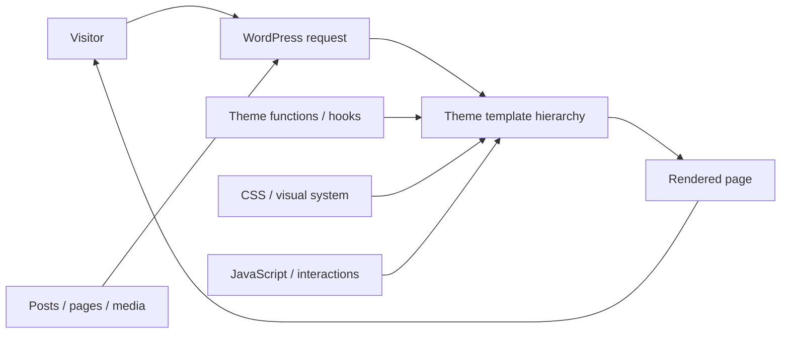
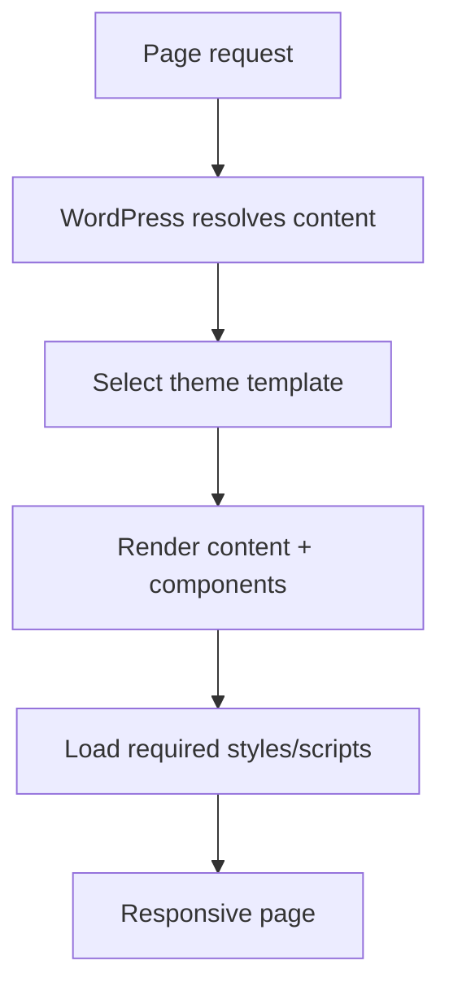
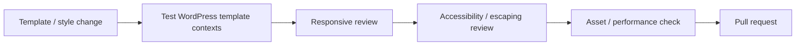

<div align="center">

# Ronal WordPress Theme

**A WordPress theme project for organizing templates, theme behavior, styling, assets, and content presentation into a maintainable website experience.**


[Browse source](https://github.com/Nischhalsubba/wp_Theme_Ronal/tree/master) · [Issues](https://github.com/Nischhalsubba/wp_Theme_Ronal/issues)

</div>

## Overview

**Ronal WordPress Theme** is documented as a theme system rather than a collection of PHP files. WordPress provides content and request context; theme templates, functions, styles, scripts, and assets turn that context into the final browser experience.

| Audience | Focus |
|---|---|
| Site editors | Content that remains understandable inside WordPress |
| Developers | Template hierarchy, theme functions, assets and hooks |
| Designers | Visual system, responsive templates, states and accessibility |
| Site owners | Content accuracy, performance, SEO and update safety |

<details open>
<summary><strong>🏗️ Interactive WordPress architecture</strong></summary>



</details>

## Rendering flow



## Getting started

```bash
git clone https://github.com/Nischhalsubba/wp_Theme_Ronal.git
cd wp_Theme_Ronal
```

Install or link the theme in a compatible WordPress development environment. Use any package/build tooling declared by the repository rather than adding parallel tooling without a reason.

## Theme quality

Follow WordPress template conventions, escape output appropriately, sanitize/validate input, keep plugins responsible for plugin-shaped functionality, enqueue assets properly, preserve keyboard navigation and visible focus, and test editor-generated content at awkward lengths because editors, with impressive consistency, will eventually find them.

## SEO & discoverability

The theme should support semantic headings, useful document landmarks, accessible images, fast rendering, canonical/meta output from the site's chosen SEO strategy, structured data compatibility, and crawlable content. Do not hard-code site-specific titles, descriptions, organization details or schema into a reusable theme unless the theme genuinely owns them.

## Contribution flow


