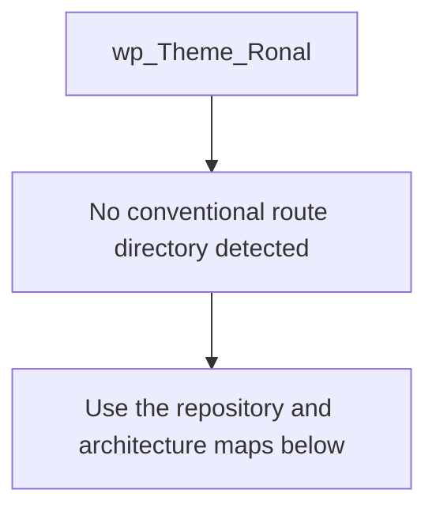
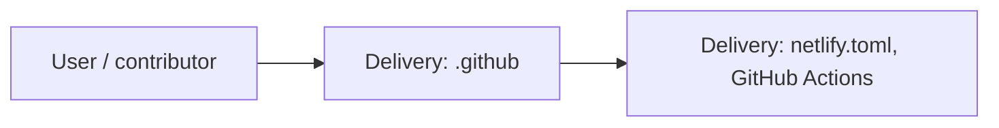
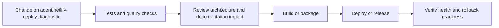
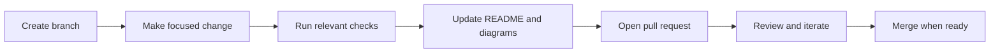

<!-- interactive-readme-standard:start -->

<div align="center">

# wp_Theme_Ronal

**Branch-aware technical guide for [`agent/netlify-deploy-diagnostic`](https://github.com/Nischhalsubba/wp_Theme_Ronal/tree/agent/netlify-deploy-diagnostic)**

<p>       </p>

<p>
  <a href="https://github.com/Nischhalsubba/wp_Theme_Ronal/tree/agent/netlify-deploy-diagnostic"><strong>Browse source</strong></a> ·
  <a href="https://github.com/Nischhalsubba/wp_Theme_Ronal/issues"><strong>Issues</strong></a> ·
  <a href="https://github.com/Nischhalsubba/wp_Theme_Ronal/codespaces/new?ref=agent%2Fnetlify-deploy-diagnostic"><strong>Open in Codespaces</strong></a>
</p>

</div>

> [!IMPORTANT]
> This guide is generated from the files actually present on `agent/netlify-deploy-diagnostic`. It links to detected source paths, preserves project-authored notes, and avoids claiming components that were not found.

## At a glance

| Item | Detected value |
|---|---|
| Purpose | A custom WordPress portfolio theme for Ronal Chhetri with Sass, Gulp, RTL, translation, image optimization, and JavaScript build workflows. |
| Branch role | Compared with `master` |
| Stack | WordPress, Sass, PHP, JavaScript, CSS, HTML |
| Manifests | package.json |
| Prerequisites | Node.js |
| Delivery | netlify.toml, GitHub Actions |
| License | No license file detected |

## Branch scope

This branch differs from the default branch in the following detected paths:

- [`.github/workflows/deploy-netlify.yml`](https://github.com/Nischhalsubba/wp_Theme_Ronal/blob/agent/netlify-deploy-diagnostic/.github/workflows/deploy-netlify.yml)
- [`README.md`](https://github.com/Nischhalsubba/wp_Theme_Ronal/blob/agent/netlify-deploy-diagnostic/README.md)

## Quick start

```bash
npm install
npm run start
```

### Configuration surface

- No committed environment example file was detected.

> Never commit secrets, private keys, production credentials, customer data, or unredacted infrastructure details.

## Repository map

```mermaid
flowchart TD
    ROOT["wp_Theme_Ronal / agent/netlify-deploy-diagnostic"]
    ROOT --> P0[".github/"]
    ROOT --> P1[".portfolio-src/"]
    ROOT --> P2["assets/"]
    ROOT --> P3["languages/"]
    ROOT --> P4["netlify-site/"]
    ROOT --> P5[".editorconfig"]
    ROOT --> P6[".eslintignore"]
    ROOT --> P7[".eslintrc.js"]
    ROOT --> P8[".gitignore"]
    ROOT --> P9["build.sh"]
    ROOT --> P10["DEPLOYMENT.md"]
    ROOT --> P11["footer.php"]
    ROOT --> P12["front-page.php"]
    ROOT --> P13["front-page1.php"]
    ROOT --> P14["functions.php"]
    ROOT --> P15["gulpfile.babel.js"]
    ROOT --> P16["header.php"]
    ROOT --> P17["home.php"]
    ROOT --> MORE["+ 16 more top-level entries"]
```



| Responsibility | Detected source paths |
|---|---|
| Delivery | [`.github`](https://github.com/Nischhalsubba/wp_Theme_Ronal/tree/agent/netlify-deploy-diagnostic/.github) |

## Website or application map



## Architecture and responsibility flow




## Quality, security, and operations

<table>
<tr>
<td width="33%" valign="top">

### Quality

- No conventional test directory was detected automatically.

Detected commands:
- `npm run start`

</td>
<td width="33%" valign="top">

### Security

- No dedicated security policy or automated dependency configuration was detected.

Review authentication, authorization, input validation, dependency updates, secret handling, and failure recovery before release.

</td>
<td width="34%" valign="top">

### Observability

- [`assets/img/Facebook-Analytics-logo.jpg`](https://github.com/Nischhalsubba/wp_Theme_Ronal/blob/agent/netlify-deploy-diagnostic/assets/img/Facebook-Analytics-logo.jpg)
- [`assets/img/Squared_Data_and_Analytics_Logo_1_ (2).jpg`](https://github.com/Nischhalsubba/wp_Theme_Ronal/blob/agent/netlify-deploy-diagnostic/assets/img/Squared_Data_and_Analytics_Logo_1_%20%282%29.jpg)
- [`assets/img/google-analytics-logo.jpg`](https://github.com/Nischhalsubba/wp_Theme_Ronal/blob/agent/netlify-deploy-diagnostic/assets/img/google-analytics-logo.jpg)
- [`assets/img/raw/Facebook-Analytics-logo.jpg`](https://github.com/Nischhalsubba/wp_Theme_Ronal/blob/agent/netlify-deploy-diagnostic/assets/img/raw/Facebook-Analytics-logo.jpg)
- [`assets/img/raw/Squared_Data_and_Analytics_Logo_1_ (2).jpg`](https://github.com/Nischhalsubba/wp_Theme_Ronal/blob/agent/netlify-deploy-diagnostic/assets/img/raw/Squared_Data_and_Analytics_Logo_1_%20%282%29.jpg)
- [`assets/img/raw/google-analytics-logo.jpg`](https://github.com/Nischhalsubba/wp_Theme_Ronal/blob/agent/netlify-deploy-diagnostic/assets/img/raw/google-analytics-logo.jpg)

Define useful logs, metrics, traces, alerts, and rollback signals for production-facing branches.

</td>
</tr>
</table>

## Delivery flow



### Automation detected

- [`.github/workflows/apply-interactive-readme.yml`](https://github.com/Nischhalsubba/wp_Theme_Ronal/blob/agent/netlify-deploy-diagnostic/.github/workflows/apply-interactive-readme.yml)
- [`.github/workflows/deploy-netlify.yml`](https://github.com/Nischhalsubba/wp_Theme_Ronal/blob/agent/netlify-deploy-diagnostic/.github/workflows/deploy-netlify.yml)

## Contribution flow



- Keep changes focused and explain architectural consequences.
- Run the checks relevant to the changed area.
- Update diagrams whenever routes, modules, data models, authentication, jobs, or delivery paths change.
- Add screenshots or recordings for visual behavior changes when useful.
- Use issues for reproducible defects and pull requests for reviewable changes.

## Ownership and support

| Topic | Source |
|---|---|
| Repository | [`Nischhalsubba/wp_Theme_Ronal`](https://github.com/Nischhalsubba/wp_Theme_Ronal) |
| Branch | [`agent/netlify-deploy-diagnostic`](https://github.com/Nischhalsubba/wp_Theme_Ronal/tree/agent/netlify-deploy-diagnostic) |
| Ownership | No CODEOWNERS file detected |
| Contributing | Use the contribution flow above |
| Support | [Open or review issues](https://github.com/Nischhalsubba/wp_Theme_Ronal/issues) |
| License | No license file detected |

<details>
<summary><strong>Documentation maintenance checklist</strong></summary>

- [ ] Purpose and branch scope are accurate.
- [ ] Setup and configuration commands still work.
- [ ] Repository, application, API, data, authentication, job, and deployment diagrams match the code.
- [ ] Tests, security controls, observability, and rollback behavior are documented.
- [ ] Links point to real files on this branch.
- [ ] No secrets or private operational details are exposed.

</details>

<!-- interactive-readme-standard:end -->

<!-- project-authored-notes:start -->
<details>
<summary><strong>Project-authored notes preserved from this branch</strong></summary>

<div align="center">

# WordPress Theme — Ronal Chhetri Portfolio

### Custom WordPress Portfolio Theme Workflow

**A WordPress portfolio theme developed with Sass, Gulp, JavaScript, BrowserSync, image optimization, RTL stylesheet generation, and translation-ready tooling.**


</div>

---

## ✨ Overview

This repository contains a custom WordPress theme workflow for a portfolio website created for **Ronal Chhetri**.

The theme is built with a frontend workflow that supports Sass compilation, JavaScript bundling, vendor scripts, image optimization, RTL stylesheet generation, translation file generation, and BrowserSync-based local development.

Original website context:

| Detail | Value |
|---|---|
| Project Type | WordPress Portfolio Theme |
| Client | Ronal Chhetri |
| Website | `www.ronalchhetri.com.np` |
| Core Workflow | Gulp + Sass + JavaScript |

---

## 🧭 Table of Contents

- [Project Purpose](#-project-purpose)
- [Designer’s Perspective](#-designers-perspective)
- [Tech Stack](#-tech-stack)
- [Theme Workflow](#-theme-workflow)
- [Available Scripts](#-available-scripts)
- [Local Development](#-local-development)
- [Suggested Theme Structure](#-suggested-theme-structure)
- [WordPress Setup Notes](#-wordpress-setup-notes)
- [Quality Checklist](#-quality-checklist)
- [Roadmap](#-roadmap)
- [License](#-license)

---

## 🎯 Project Purpose

The purpose of this repository is to provide a WordPress theme foundation for a personal portfolio website.

The theme workflow is designed to help with:

- writing modular Sass
- compiling production-ready CSS
- generating RTL stylesheets
- bundling vendor and custom JavaScript
- optimizing image assets
- generating translation `.pot` files
- maintaining a smoother WordPress development workflow

---

## 🎨 Designer’s Perspective

A portfolio theme needs to balance visual identity, content editing, performance, and maintainability.

From a designer-developer perspective, the theme should make it easy to maintain:

- strong visual hierarchy
- clean portfolio/project sections
- reusable layout patterns
- responsive typography
- fast-loading images
- smooth interactions
- accessible navigation
- translation-ready text

The Gulp workflow helps reduce manual tasks so the design can stay polished while the theme remains maintainable.

---

## 🛠 Tech Stack

| Layer | Technology | Purpose |
|---|---|---|
| CMS | WordPress | Theme runtime and content management |
| Styles | Sass | Modular source styling |
| Build Tool | Gulp | Task automation |
| JavaScript | Babel + Gulp tasks | Vendor/custom script processing |
| Local Dev | BrowserSync | Live reload development workflow |
| Images | gulp-imagemin | Image optimization |
| RTL | gulp-rtlcss | Right-to-left stylesheet generation |
| Translation | gulp-wp-pot | WordPress `.pot` file generation |
| Slider/Carousel | Glide.js | Frontend slider dependency |
| Linting | ESLint WordPress config | WordPress-oriented JS code quality |

---

## ⚙️ Theme Workflow

The package scripts reveal a WordPress-focused build workflow.

| Workflow | Description |
|---|---|
| Styles | Compile Sass into theme CSS |
| RTL Styles | Generate RTL CSS support |
| Vendor JS | Bundle/process third-party scripts |
| Custom JS | Bundle/process theme custom scripts |
| Images | Optimize image assets |
| Cache | Clear Gulp cache |
| Translate | Generate WordPress translation POT file |

---

## 📜 Available Scripts

| Command | Purpose |
|---|---|
| `npm start` | Runs the default Gulp workflow |
| `npm run styles` | Compiles theme styles |
| `npm run stylesRTL` | Generates RTL styles |
| `npm run vendorsJS` | Processes vendor JavaScript |
| `npm run customJS` | Processes custom JavaScript |
| `npm run images` | Optimizes images |
| `npm run clearCache` | Clears cached build assets |
| `npm run translate` | Generates WordPress translation file |

---

## 🚀 Local Development

### Prerequisites

- WordPress local environment
- Node.js
- npm
- Gulp CLI if needed

### Install dependencies

```bash
npm install
```

### Start development workflow

```bash
npm start
```

### Compile only styles

```bash
npm run styles
```

### Optimize images

```bash
npm run images
```

### Generate translation template

```bash
npm run translate
```

---

## 📁 Suggested Theme Structure

A WordPress theme using this workflow commonly includes:

```text
wp_Theme_Ronal/
├── assets/
│   ├── images/
│   ├── js/
│   └── sass/
├── template-parts/
├── languages/
├── functions.php
├── style.css
├── header.php
├── footer.php
├── index.php
├── page.php
├── single.php
├── package.json
└── README.md
```

The exact structure may vary, but the theme should keep templates, assets, translation files, and build source files organized clearly.

---

## 📝 WordPress Setup Notes

To use the theme locally:

1. Place the theme folder inside:

```text
wp-content/themes/
```

2. Activate the theme from WordPress admin:

```text
Appearance → Themes
```

3. Configure menus, homepage, portfolio pages, and any required theme options.

4. Run the Gulp workflow while editing assets.

---

## ✅ Quality Checklist

### WordPress QA

- [ ] Theme activates without fatal errors.
- [ ] `functions.php` loads correctly.
- [ ] Header and footer render properly.
- [ ] Menus are registered and usable.
- [ ] Portfolio pages render correctly.
- [ ] WordPress template hierarchy behaves as expected.

### Frontend QA

- [ ] Sass compiles successfully.
- [ ] JavaScript bundles correctly.
- [ ] Images are optimized.
- [ ] RTL stylesheet is generated if needed.
- [ ] BrowserSync/live reload works.
- [ ] Responsive layout works on mobile/tablet/desktop.
- [ ] Glide.js interactions work if used.

### Content QA

- [ ] Portfolio content is accurate.
- [ ] Client name and domain are correct.
- [ ] Placeholder text is removed.
- [ ] Images are optimized and have alt text.
- [ ] Contact information is correct.

---

## 🗺 Roadmap

- Add screenshot previews to this README.
- Document actual theme file structure in more detail.
- Add installation screenshots.
- Add custom post type documentation if used.
- Add block/editor support notes if implemented.
- Add performance optimization notes.
- Add accessibility audit checklist.
- Add deployment notes for production WordPress hosting.

---

## 📜 License

This project is licensed under the **MIT License**.

---

<div align="center">

Developed as a WordPress portfolio theme workflow using Sass, Gulp, and JavaScript.

</div>

</details>
<!-- project-authored-notes:end -->
