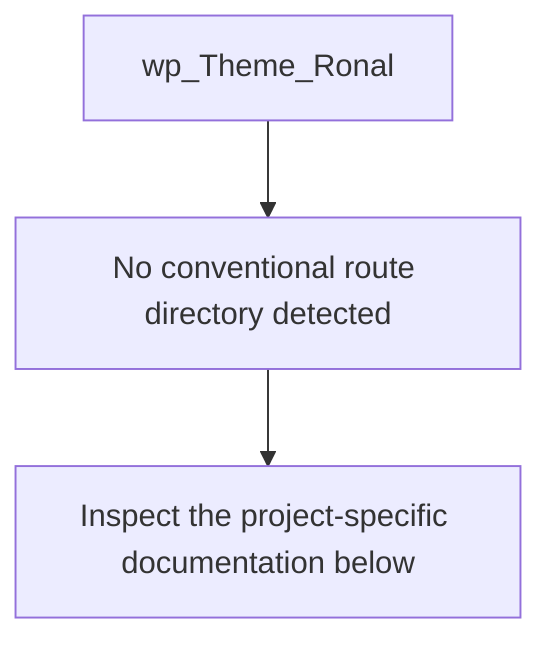
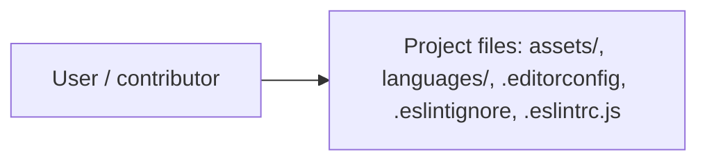
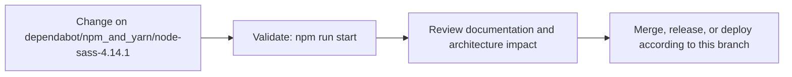

# Wordpress Theme

<!-- interactive-readme-standard:start -->

> [!NOTE]
> **Branch-specific documentation:** this section is maintained for [`dependabot/npm_and_yarn/node-sass-4.14.1`](https://github.com/Nischhalsubba/wp_Theme_Ronal/tree/dependabot/npm_and_yarn/node-sass-4.14.1). It is generated from the files present on this branch and preserves the project-authored README below.

<details open>
<summary><strong>Interactive repository guide</strong></summary>

## Branch overview

| Item | Value |
|---|---|
| Repository | [`Nischhalsubba/wp_Theme_Ronal`](https://github.com/Nischhalsubba/wp_Theme_Ronal) |
| Branch | [`dependabot/npm_and_yarn/node-sass-4.14.1`](https://github.com/Nischhalsubba/wp_Theme_Ronal/tree/dependabot/npm_and_yarn/node-sass-4.14.1) |
| Detected stack | WordPress, Sass, PHP, JavaScript, CSS |
| Detected manifests | package.json |
| Documentation policy | Every maintained branch must explain purpose, setup, structure, architecture, flows, testing, delivery, security, and ownership. |

## Repository structure


The diagram is generated from the branch's actual top-level files and directories. Use the branch link above for complete source navigation.

## Website or application structure



## Application and responsibility flow



## Change-to-delivery flow



## README requirements for this branch

- Explain what this branch contains and how it differs from the default branch.
- Keep installation, configuration, usage, testing, deployment, security, support, and license information accurate.
- Document repository, website or application, API, data, authentication, background-job, and deployment flows when they exist.
- Prefer Mermaid diagrams and expandable `<details>` sections for visual navigation.
- Link diagrams and modules to real source paths; never invent missing components.
- Preserve project-specific documentation and update diagrams whenever architecture or major paths change.
- Treat secrets, private infrastructure, customer data, and credentials as prohibited README content.

</details>

<!-- interactive-readme-standard:end -->

Development of this website is done using gulp and sass for WordPress.

## Technology used
Sass, Gulp and Javascript


```

Website Details
Portfolio website
client: Ronal Chhetri
URL: www.ronalchhetri.com.np


## License
[MIT](https://choosealicense.com/licenses/mit/)
