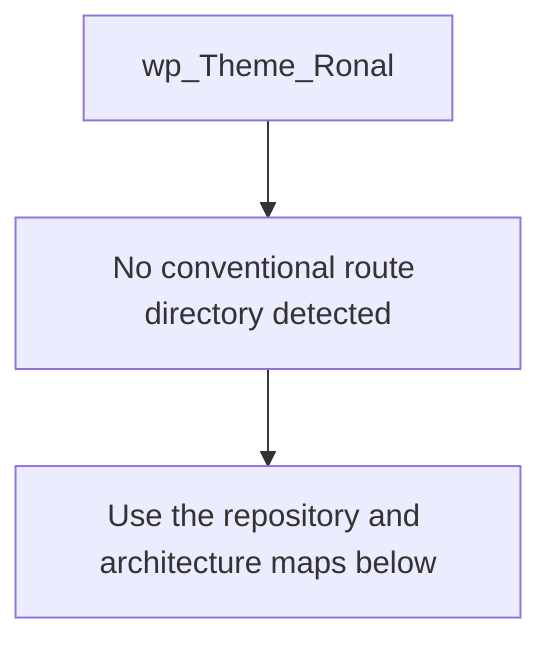
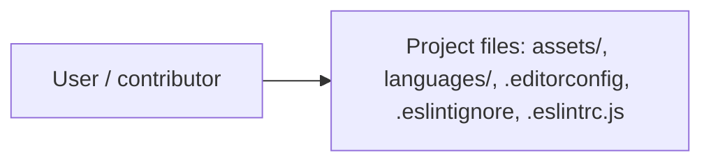
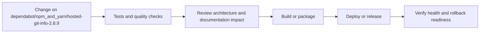
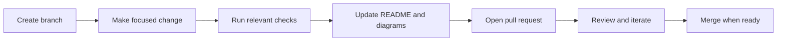

<!-- interactive-readme-standard:start -->

<div align="center">

# wp_Theme_Ronal

**Branch-aware technical guide for [`dependabot/npm_and_yarn/hosted-git-info-2.8.9`](https://github.com/Nischhalsubba/wp_Theme_Ronal/tree/dependabot/npm_and_yarn/hosted-git-info-2.8.9)**

<p>      </p>

<p>
  <a href="https://github.com/Nischhalsubba/wp_Theme_Ronal/tree/dependabot/npm_and_yarn/hosted-git-info-2.8.9"><strong>Browse source</strong></a> ·
  <a href="https://github.com/Nischhalsubba/wp_Theme_Ronal/issues"><strong>Issues</strong></a> ·
  <a href="https://github.com/Nischhalsubba/wp_Theme_Ronal/codespaces/new?ref=dependabot%2Fnpm_and_yarn%2Fhosted-git-info-2.8.9"><strong>Open in Codespaces</strong></a>
</p>

</div>

> [!IMPORTANT]
> This guide is generated from the files actually present on `dependabot/npm_and_yarn/hosted-git-info-2.8.9`. It links to detected source paths, preserves project-authored notes, and avoids claiming components that were not found.

## At a glance

| Item | Detected value |
|---|---|
| Purpose | A WordPress project documented from the current branch structure and manifests. |
| Branch role | Compared with `master` |
| Stack | WordPress, Sass, PHP, JavaScript, CSS |
| Manifests | package.json |
| Prerequisites | Node.js |
| Delivery | No conventional deployment configuration detected |
| License | No license file detected |

## Branch scope

This branch differs from the default branch in the following detected paths:

- [`README.md`](https://github.com/Nischhalsubba/wp_Theme_Ronal/blob/dependabot/npm_and_yarn/hosted-git-info-2.8.9/README.md)
- [`package-lock.json`](https://github.com/Nischhalsubba/wp_Theme_Ronal/blob/dependabot/npm_and_yarn/hosted-git-info-2.8.9/package-lock.json)

## Quick start

```bash
npm install
npm run start
```

### Configuration surface

- No committed environment example file was detected.

> Never commit secrets, private keys, production credentials, customer data, or unredacted infrastructure details.

## Repository map

```mermaid
flowchart TD
    ROOT["wp_Theme_Ronal / dependabot/npm_and_yarn/hosted-git-info-2.8.9"]
    ROOT --> P0["assets/"]
    ROOT --> P1["languages/"]
    ROOT --> P2[".editorconfig"]
    ROOT --> P3[".eslintignore"]
    ROOT --> P4[".eslintrc.js"]
    ROOT --> P5[".gitignore"]
    ROOT --> P6["footer.php"]
    ROOT --> P7["front-page.php"]
    ROOT --> P8["front-page1.php"]
    ROOT --> P9["functions.php"]
    ROOT --> P10["gulpfile.babel.js"]
    ROOT --> P11["header.php"]
    ROOT --> P12["home.php"]
    ROOT --> P13["index.php"]
    ROOT --> P14["package-lock.json"]
    ROOT --> P15["package.json"]
    ROOT --> P16["page-contact-us.php"]
    ROOT --> P17["page-portfolio.php"]
    ROOT --> MORE["+ 9 more top-level entries"]
```



| Responsibility | Detected source paths |
|---|---|
| Project files | [`assets/`](https://github.com/Nischhalsubba/wp_Theme_Ronal/tree/dependabot/npm_and_yarn/hosted-git-info-2.8.9/assets/), [`languages/`](https://github.com/Nischhalsubba/wp_Theme_Ronal/tree/dependabot/npm_and_yarn/hosted-git-info-2.8.9/languages/), [`.editorconfig`](https://github.com/Nischhalsubba/wp_Theme_Ronal/blob/dependabot/npm_and_yarn/hosted-git-info-2.8.9/.editorconfig), [`.eslintignore`](https://github.com/Nischhalsubba/wp_Theme_Ronal/blob/dependabot/npm_and_yarn/hosted-git-info-2.8.9/.eslintignore), [`.eslintrc.js`](https://github.com/Nischhalsubba/wp_Theme_Ronal/blob/dependabot/npm_and_yarn/hosted-git-info-2.8.9/.eslintrc.js) |

## Website or application map



## Architecture and responsibility flow




## Quality, security, and operations

<table>
<tr>
<td width="33%" valign="top">

### Quality

- No conventional test directory was detected automatically.

Detected commands:
- `npm run start`

</td>
<td width="33%" valign="top">

### Security

- No dedicated security policy or automated dependency configuration was detected.

Review authentication, authorization, input validation, dependency updates, secret handling, and failure recovery before release.

</td>
<td width="34%" valign="top">

### Observability

- [`assets/img/google-analytics-logo.jpg`](https://github.com/Nischhalsubba/wp_Theme_Ronal/blob/dependabot/npm_and_yarn/hosted-git-info-2.8.9/assets/img/google-analytics-logo.jpg)
- [`assets/img/Squared_Data_and_Analytics_Logo_1_ (2).jpg`](https://github.com/Nischhalsubba/wp_Theme_Ronal/blob/dependabot/npm_and_yarn/hosted-git-info-2.8.9/assets/img/Squared_Data_and_Analytics_Logo_1_%20%282%29.jpg)
- [`assets/img/Facebook-Analytics-logo.jpg`](https://github.com/Nischhalsubba/wp_Theme_Ronal/blob/dependabot/npm_and_yarn/hosted-git-info-2.8.9/assets/img/Facebook-Analytics-logo.jpg)
- [`assets/img/raw/google-analytics-logo.jpg`](https://github.com/Nischhalsubba/wp_Theme_Ronal/blob/dependabot/npm_and_yarn/hosted-git-info-2.8.9/assets/img/raw/google-analytics-logo.jpg)
- [`assets/img/raw/Squared_Data_and_Analytics_Logo_1_ (2).jpg`](https://github.com/Nischhalsubba/wp_Theme_Ronal/blob/dependabot/npm_and_yarn/hosted-git-info-2.8.9/assets/img/raw/Squared_Data_and_Analytics_Logo_1_%20%282%29.jpg)
- [`assets/img/raw/Facebook-Analytics-logo.jpg`](https://github.com/Nischhalsubba/wp_Theme_Ronal/blob/dependabot/npm_and_yarn/hosted-git-info-2.8.9/assets/img/raw/Facebook-Analytics-logo.jpg)

Define useful logs, metrics, traces, alerts, and rollback signals for production-facing branches.

</td>
</tr>
</table>

## Delivery flow



### Automation detected

- No GitHub Actions workflow files were detected.

## Contribution flow



- Keep changes focused and explain architectural consequences.
- Run the checks relevant to the changed area.
- Update diagrams whenever routes, modules, data models, authentication, jobs, or delivery paths change.
- Add screenshots or recordings for visual behavior changes when useful.
- Use issues for reproducible defects and pull requests for reviewable changes.

## Ownership and support

| Topic | Source |
|---|---|
| Repository | [`Nischhalsubba/wp_Theme_Ronal`](https://github.com/Nischhalsubba/wp_Theme_Ronal) |
| Branch | [`dependabot/npm_and_yarn/hosted-git-info-2.8.9`](https://github.com/Nischhalsubba/wp_Theme_Ronal/tree/dependabot/npm_and_yarn/hosted-git-info-2.8.9) |
| Ownership | No CODEOWNERS file detected |
| Contributing | Use the contribution flow above |
| Support | [Open or review issues](https://github.com/Nischhalsubba/wp_Theme_Ronal/issues) |
| License | No license file detected |

<details>
<summary><strong>Documentation maintenance checklist</strong></summary>

- [ ] Purpose and branch scope are accurate.
- [ ] Setup and configuration commands still work.
- [ ] Repository, application, API, data, authentication, job, and deployment diagrams match the code.
- [ ] Tests, security controls, observability, and rollback behavior are documented.
- [ ] Links point to real files on this branch.
- [ ] No secrets or private operational details are exposed.

</details>

<!-- interactive-readme-standard:end -->

<!-- project-authored-notes:start -->
<details>
<summary><strong>Project-authored notes preserved from this branch</strong></summary>

# Wordpress Theme

Development of this website is done using gulp and sass for WordPress.

## Technology used
Sass, Gulp and Javascript


```

Website Details
Portfolio website
client: Ronal Chhetri
URL: www.ronalchhetri.com.np


## License
[MIT](https://choosealicense.com/licenses/mit/)

</details>
<!-- project-authored-notes:end -->
